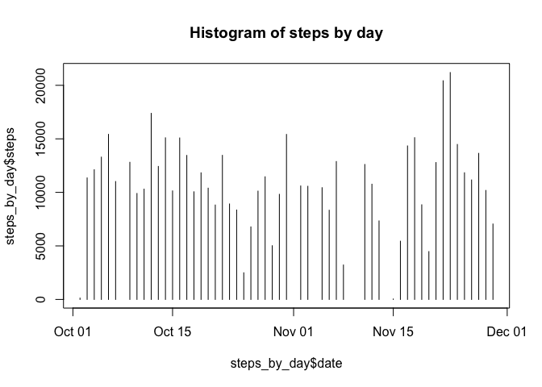
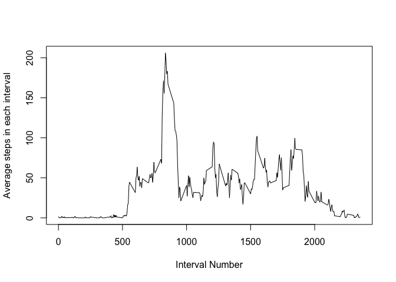
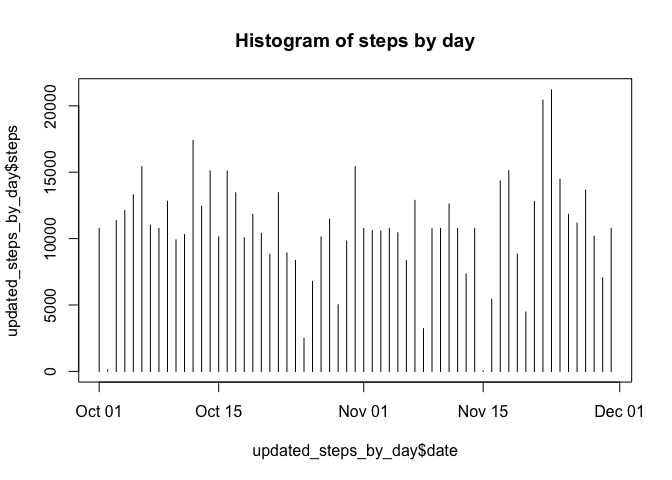
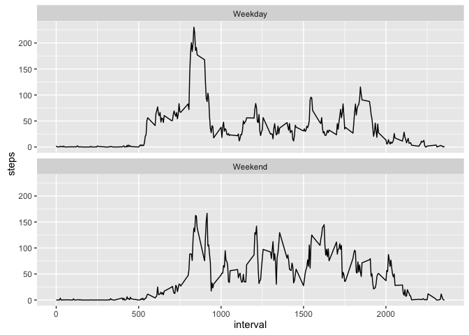

# Reproducible Research: Peer Assessment 1


## Loading and preprocessing the data

Unzip the activity data file, and read the contents into a data table. 

```r
unzip("activity.zip")
activity_data <- read.csv("activity.csv")
activity_data$date <- as.Date(activity_data$date)
```
## What is mean total number of steps taken per day?

Compute total steps by day, and make a histogram of the total number of steps taken each day

```r
steps_by_day <- aggregate(steps ~ date, activity_data, sum)
plot(steps_by_day$date,steps_by_day$steps, type="h",main = "Histogram of steps by day")
```

<!-- -->

```r
print(summary(steps_by_day))
```

```
##       date                steps      
##  Min.   :2012-10-02   Min.   :   41  
##  1st Qu.:2012-10-16   1st Qu.: 8841  
##  Median :2012-10-29   Median :10765  
##  Mean   :2012-10-30   Mean   :10766  
##  3rd Qu.:2012-11-16   3rd Qu.:13294  
##  Max.   :2012-11-29   Max.   :21194
```

```r
mean_steps_by_day <- format(mean(steps_by_day$steps),digits=7)
median_steps_by_day <- median(steps_by_day$steps)
```

Mean steps by day is 10766.19. Median steps by day is 10765. 

## What is the average daily activity pattern?
The code below calculates average number of steps for each interval across all days, and plots the average daily activity pattern.

```r
average_daily_step_pattern <- aggregate(steps ~ interval, activity_data, mean)
plot(average_daily_step_pattern$interval,average_daily_step_pattern$steps, type="l",ylab = "Average steps in each interval", xlab="Interval Number")
```

<!-- -->

The code below finds the interval which contains the interval with maximum number of steps. 

```r
interval_with_max_steps <- average_daily_step_pattern[order(average_daily_step_pattern$steps,decreasing = T)[1],]
print(interval_with_max_steps)
```

```
##     interval    steps
## 104      835 206.1698
```

Interval with max steps is **835** with average steps of 206.1698113. 

## Imputing missing values

Calculate and report the total number of missing values in the dataset (i.e. the total number of rows with NAs)


```r
na_count <- sum(is.na(activity_data$steps))
print(na_count)
```

```
## [1] 2304
```

Total number of rows with NAs is **2304** (Already verified that there are no NAs in "interval"" or "date" columns).

** Strategy for missing items **: We will use an average of steps for that interval across all the days.

The following code creates a new data table by filling in the values for missing items.


```r
# create a copy of the original dataset
updated_activity_data <- activity_data
# Update the missing values with mean of of the values for that interval
# We use match function to look up values from the previously created "average_daily_step_pattern" data table.
updated_activity_data[is.na(updated_activity_data$steps),]$steps <-
    average_daily_step_pattern[match(updated_activity_data[is.na(updated_activity_data$steps),]$interval,average_daily_step_pattern$interval),2]
```

The following code recacluates the mean and median steps per day after filling in missing values for steps. 


```r
updated_steps_by_day <- aggregate(steps ~ date, updated_activity_data, sum)
plot(updated_steps_by_day$date,updated_steps_by_day$steps, type="h",main = "Histogram of steps by day")
```

<!-- -->

```r
print(summary(updated_steps_by_day))
```

```
##       date                steps      
##  Min.   :2012-10-01   Min.   :   41  
##  1st Qu.:2012-10-16   1st Qu.: 9819  
##  Median :2012-10-31   Median :10766  
##  Mean   :2012-10-31   Mean   :10766  
##  3rd Qu.:2012-11-15   3rd Qu.:12811  
##  Max.   :2012-11-30   Max.   :21194
```

**The mean and median numbers in the summary above were fairly similar to the previous numbers. I think this is because of the following two things.**

* Previously the functions used to compute mean and median defaut to ignoring the NA values. 
* We have updated the missing values with the mean value for that interval. Hence, the mean of the updated array doesn't change. 

## Are there differences in activity patterns between weekdays and weekends?

The following code creates a new column sorting the dates into "Weekend" and "Weekday", and then takes average of steps for each interval grouping the dates separately into "Weekend" and "Weekday"

```r
updated_activity_data$weekday <- ifelse(grepl("Sat|Sun",weekdays(updated_activity_data$date)),"Weekend","Weekday")

updated_average_daily_step_pattern <- aggregate(steps ~ interval+weekday,  updated_activity_data, mean)
```

The following code creates a two panel plot showing the activity patterns for the weekdays and weekends. 

It can be seen tha the activity is more spread out on the weekends, where as it had a stronger peak in the weekdays around the morning time. 

```r
library(ggplot2)
g<-ggplot(updated_average_daily_step_pattern,aes(interval,steps))+geom_line()+facet_wrap(~weekday,nrow=2)
g
```

<!-- -->
